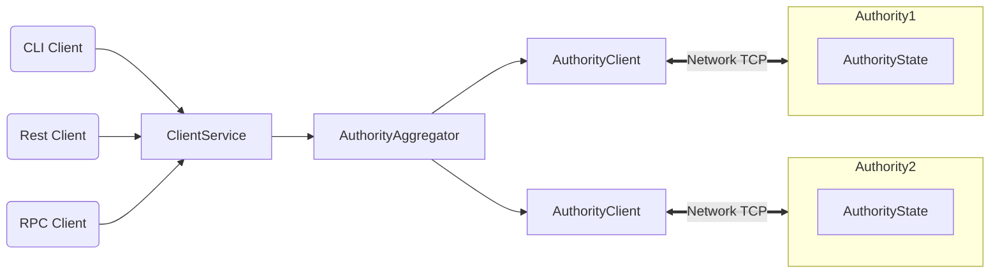

# Stakewars-helper

|             |             |
| ----------- | ----------- |
| Welcome to Stakewars, a next-generation smart contract platform with high throughput, low latency, and an asset-oriented programming model powered by the [Move programming language](https://github.com/MystenLabs/awesome-move)! Find everything you need within the [Sui Developer Guides](doc/src/learn/index.md) and supporting materials below.      |       |
| Welcome to Stake Wars: Episode III A New Validator. Stake Wars is a program that helps the community become familiar with what it means to be a NEAR validator, and gives the community an early chance to access the chunk-only producer. Stake Wars offers rewards that support new members who want to join mainnet as a validator starting from the end of September 2022. I hope this document will be with you! |       |
## Quick links

* To learn how to use Sui, take our [end-to-end tutorial](doc/src/explore/tutorials.md).
* To jump right into building smart contract applications on top of Sui, start at the [Move Smart Contract Quick Start](doc/src/build/move.md).
* To experiment with a sample Sui wallet, check out [Wallet Quick Start](doc/src/build/wallet.md).
* To understand what's possible by browsing Move code built on top of Sui, review the [examples](doc/src/explore/examples.md).
* To start coding against Sui's REST APIs, start at the [API reference](https://app.swaggerhub.com/apis/arun-koshy/sui-api).
* To learn what distinguishes Sui from other blockchain systems, see [How Sui Differs?](doc/src/learn/sui-compared.md).
* To go deep on how Sui works, read the [Sui Smart Contract Platform](doc/paper/sui.pdf) white paper.
* To help Sui grow, follow [Contributing to Sui](doc/src/contribute/index.md).
* To connect with the Sui community, join our [Discord](https://discord.gg/sui).

### Highlights

Sui offers:

* Unmatched scalability, instant settlement
* A safe smart contract language accessible to mainstream developers
* Ability to define rich and composable on-chain assets
* Better user experience for web3 apps

Sui is the only blockchain today that can scale with the growth of web3 while achieving industry-leading performance, cost, programmability, and usability. As we push towards mainnet launch, we will demonstrate capacity beyond the transaction processing capabilities of established systems – traditional and blockchain alike. We see Sui as the first internet-scale programmable blockchain platform, a foundational layer for web3.

## Architecture

## Overview

